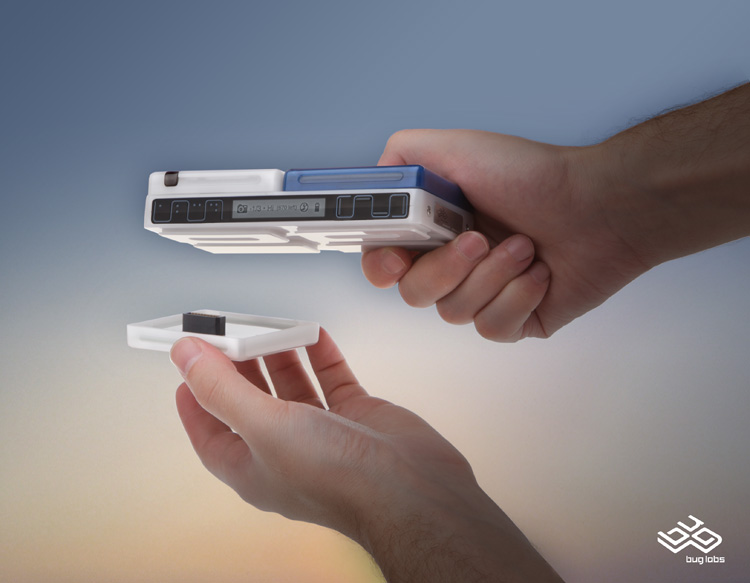



[bug labs](http://buglabs.net/) has come out of stealth mode at last. If you've got a gadget in you screaming to get out then I've got good news. :smile:

## What is the BUG?

The basic concept behind Bug is that you have a basic gadget chassis called BUGbase which you program. You can then plug into the chassis a number of add on modules called BUGmodules like GPS, touch sensitive LCD, accelerometer motion detector &amp; digital camera. More BUGmodules like a mini-keyboard and speaker, are due early next year.

## What will BUG mean for you?

- *Gadget design just got a whole lot more accessible* -- Prior to the BUG, you'd need a serious amount of money to design, manufacture and program your gadget. All without really knowing whether there was any demand for your gadget.
- *Time to market will be compressed* --  A typical hardware production process takes a long time. First design your product, then have a test run produced then re-design and so on. BUG shortens that process considerable. At the very least you can prototype your gadget very quickly.
- *Niche gadgets will now be viable* -- One of the biggest fixed costs in creating any device is creating the moldings. Whether you make one device or a million the cost of the moldings is the same. BUG changes that, you don't need to create a molding!

There is a blog for you to keep up with all things Bug. **Bug is shipping Q4 2007!**. More BUGmodules are due Q1 2008.
