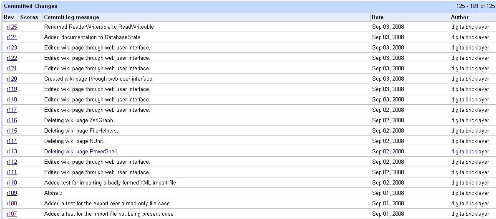

[Google Code](http://code.google.com/) is a fabulous, minimalist open source development portal. I love it because there's no faffing around and it uses lots of standard open source development tools like [subversion](http://subversion.tigris.org/).

One of the more bizarre design decisions Google made when they developed the service was to show changes to code and changes to the wiki pages in the same place.

When I go to the history page, I just want to see a change log of software changes not changes to the wiki pages as well. Saving the wiki into subversion is a great idea, I just don't see why it has to use the same repository as the project source code.
