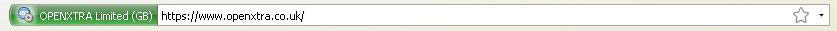
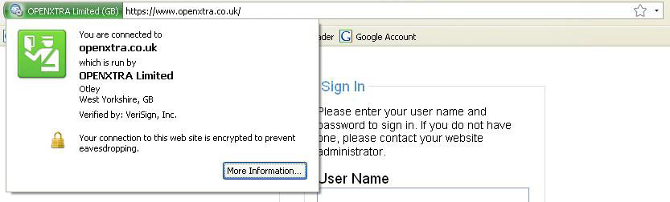
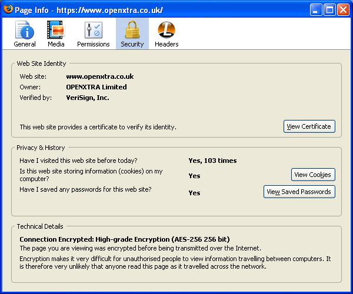

Firefox now has full [enhanced SSL certificate](https://en.wikipedia.org/wiki/Extended_Validation_Certificate) support at last with the arrival of version 3. Enhanced SSL certificates verify that a website is owned by whomever claims to own it. Very useful in the largely anonymous Internet.

Expand the image above to see what it looks like. In the secure part of a site, for instance during checkout, you will now see a green area at the start of the *Navigation Toolbar*. The green area lists the verified company or organisation name and the country to which the secure SSL certificate has been assigned. If you hover your mouse over the green area a tool tip is displayed showing who authenticated the certificate.

If you click on the green area more information about the owner of the certificate is displayed something like the image below:

Further information about the certificate is available by clicking the *more information* button.

Whilst it is welcome progress that Firefox is displaying information about the new enhanced SSL certificates, I can't help thinking that the information would be better displayed on none secure pages too. After all, I don't want to be in any doubt who I'm dealing with and the sooner I know the better. Why leave it until I've reached the checkout pages on your typical e-commerce website?
