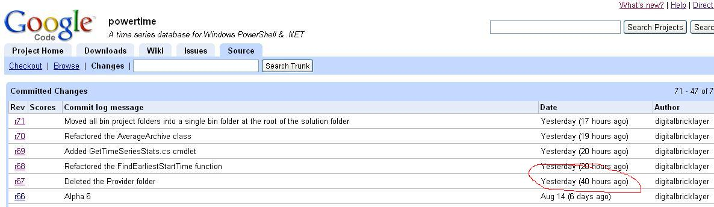

Whilst [Google Code](http://code.google.com/) is a very good open source repository service, it does have a few wrinkles. Take the image below:

Unless I've been missing something these last few years, there are only 24 hours in a day!
