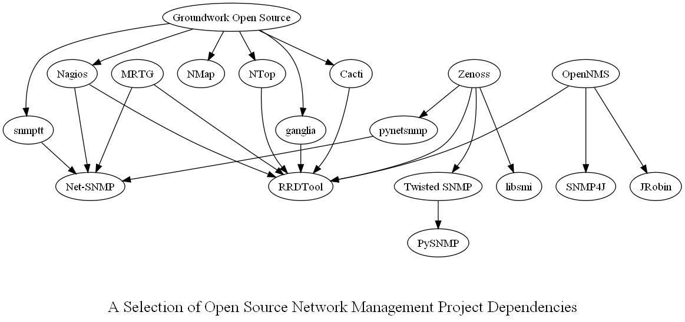

Almost as a doodle I thought I'd create a graph depicting the dependencies between a selection of open source network management projects.

Once I'd done it, it occurred to me how much just about everything depends on just a couple of projects or project variants of, RRDTool &amp; Net-SNMP.

The main conclusion I draw from the above graph is that if you wish to create a thriving platform for open source network management, you'd better have something like those two hub projects.

What is perhaps most surprising is not that there are hub projects, but that there are only two of them in the whole of network management. I think that there should be a lot more.
