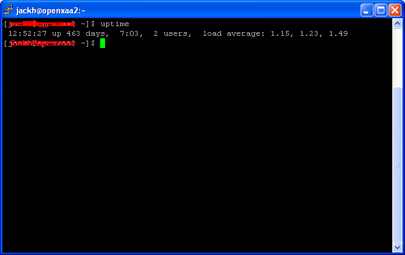

I was messing around inside *top* trying to diagnose a server slowdown and I noticed that my server has been up for 463 days. The server runs Linux Centos 4.4.

Want to share your server uptime? :wink:

**Update October 2022**: I now do realise that this is perhaps the dumbest post on this entire blog.
