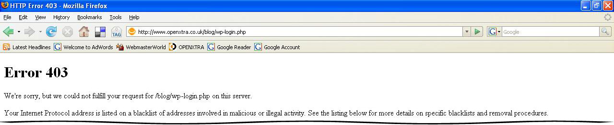

One of my pet hates is coming into the office only to be presented with a nice problem on the website. This morning I tried to log into [this website]() and saw the screenshot above.

All sorts of things went through my mind. Have we been hacked? Fortunately not. :smile:

The explanation was much simpler. The [Bad Behavior Wordpress plug-in](http://www.bad-behavior.ioerror.us/) we use to keep the internet wild west at bay decided to issue permanent false positives. So, anybody trying to log into the blog would have been given the same error.

Happily the blog itself was still working fine...just the admin system was affected.

The Bad Behavior plug-in author very quickly patched the problem. So all we had to do was install the patch and everything was back to normal. Phew! :wink:

All software has problems/bugs, what *really* counts is how diligently the authors diagnose then fix the problem.
